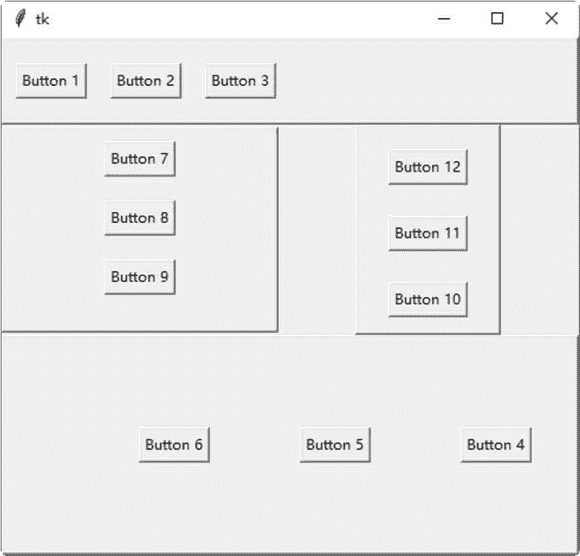

# Tkinter pack()布局

> 原文：[`www.weixueyuan.net/a/556.html`](http://www.weixueyuan.net/a/556.html)

所有 tkinter 控件都可以使用以下方法设置控件在窗口内的几何位置。

*   pack()：将控件放置在父控件内之前，规划此控件在区块内的位置。
*   grid()：将控件放置在父控件内之前，规划此控件为一个表格类型的架构。
*   place()：将控件放置在父控件内的特定位置。

本节重点介绍 pack（） 方法。后面会介绍另外两个方法。

pack() 方法依照其内的属性设置，将控件放置在 Frame 控件（窗体）或窗口内。当用户创建一个 Frame 控件后，就可以开始将控件放入。Frame 控件内存储控件的位置叫作 parcel。

如果用户想要将一组控件依照顺序放入，就必须将这些控件的 anchor 属性设成相同的。如果没有设置任何选项，这些控件就会从上而下排列。

## 1\. pack()方法参数选项

#### 1) expand

此选项让控件使用所有剩下的空间。如此当窗口改变大小时，才能让控件使用多余的空间。如果 expand 等于 1，当窗口改变大小时，窗体就会占满整个窗口剩余的空间；如果 expand 等于 0，当窗口改变大小时，窗体就维持不变。

#### 2) fill

此选项决定控件如何填满 parcel 的空间，可以是 X、Y、BOTH 或 NONE，此选项必须在 expand 等于 1 才有作用。当 fill 等于 X 时，窗体会占满整个窗口 X 方向剩余的空间；当 fill 等于 Y 时，窗体会占满整个窗口 Y 方向剩余的空间；当 fill 等于 BOTH 时，窗体会占满整个窗口剩余的空间；当 fill 等于 NONE 时，窗体维持不变。

#### 3) ipadx,ipady

此选项与 fill 选项共同使用，以定义窗体内的控件与窗体边界之间的距离。此选项的单位是像素，也可以是其他测量单位，如厘米、英寸等。

#### 4) padx,pady

此选项定义控件之间的距离，单位是像素，也可以是其它测量单位，如厘米、英寸等。

#### 5) side

此选项定义控件放置的位置，可以是 TOP（靠上对齐）、BOTTOM（靠下对齐）、LEFT（靠左对齐）或 RIGHT（靠右对齐）。

## 2\. pack()方法的实际使用

下面的示例是在窗口内创建 4 个窗体，在每一个窗体内创建三个按钮。使用了不同的参数创建这些窗体与按钮。

```

#pack()方法使用
from tkinter import *
#主窗口
win = Tk()
#第一个窗体
frame1 = Frame (win, relief=RAISED, borderwidth=2)
frame1 .pack(side=TOP, fill=BOTH, ipadx=13, ipady=13, expand=0)
Button(frame1,text="Button 1") .pack(side=LEFT, padx=13, pady=13)
Button(frame1, text="Button 2") .pack(side=LEFT, padx=13, pady=13)
Button(frame1, text="Button 3") .pack (side=LEFT, padx=13, pady=13)

#第二个窗体
frame2 = Frame (win, relief=RAISED, borderwidth=2)
frame2 . pack (side=BOTTOM, fill=NONE, ipadx="1c", ipady="1c", expand=1)
Button (frame2, text="Button 4") .pack (side=RIGHT, padx="1c", pady="1c")
Button (frame2,text="Button 5") .pack (side=RIGHT, padx="1c", pady="1c")
Button (frame2,text="Button 6") .pack (side=RIGHT, padx="1c", pady="1c")

#第三个窗体
frame3 = Frame (win, relief=RAISED, borderwidth=2)
frame3\. pack (side=LEFT, fill=X, ipadx="0.1i", ipady="0.1i", expand=1)
Button (frame3, text="Button 7") .pack(side=TOP, padx="0.1i", pady="0.1i")
Button (frame3, text="Button 8") .pack(side=TOP, padx="0.1i", pady="0.1i")
Button(frame3, text="Button 9") .pack(side=TOP, padx="0.1i", pady="0.1i")

#第四个窗体
frame4 = Frame (win, relief=RAISED, borderwidth=2)
frame4\. pack (side=RIGHT, fill=Y, ipadx="13p", ipady="13p", expand=1)
Button(frame4, text="Button 13") . pack (side=BOTTOM, padx="13p",
pady="13p")
Button (frame4, text="Button 11") .pack (side=BOTTOM, padx="13p" ,
pady="13p")
Button (frame4, text="Button 12") .pack (side=BOTTOM, padx="13p",
pady="13p")
#开始窗口的事件循环
win . mainloop()
```

保存为 .pyw 文件后，直接双击运行该文件，结果如图 1 所示。


图 1：程序运行结果

## 3\. 示例代码解析

上述示例代码分析如下：

*   第 6 行：创建第一个 Frame 控件，以作为窗体。此窗体的外形突起，边框厚度为 2 像素。
*   第 7 行：此窗体在窗口的顶端（side=TOP），当窗口改变大小时，窗体本应会占满整个窗口的剩余空间（fill=BOTH），但因设置 expand=0，所以窗体维持不变。控件与窗体边界之间的水平距离是 13 像素，垂直距离是 13 像素。
*   第 8～13 行：在第一个窗体内创建三个按钮。这三个按钮从窗体的左边开始排列（side=LEFT），控件之间的水平距离是 13 像素，垂直距离是 13 像素。
*   第 13 行：创建第二个 Frame 控件，以作为窗体。此窗体的外形突起，边框厚度为 2 像素。
*   第 14 行：此窗体在窗口的底端（side=BOTTOM），当窗口改变大小时，窗体不会占满整个窗口的剩余空间（fill=NONE）。控件与窗体边界之间的水平距离是 1 厘米，垂直距离是 1 厘米。
*   第 15～17 行：在第一个窗体内创建三个按钮。这三个按钮从窗体的右边开始排列（side=RIGHT），控件之间的水平距离是 1 厘米，垂直距离是 1 厘米。
*   第 20 行：创建第三个 Frame 控件，以作为窗体。此窗体的外形突起，边框厚度为 2 像素。
*   第 21 行：此窗体在窗口的左边（side=LEFT），当窗口改变大小时，窗体会占满整个窗口的剩余水平空间（fill=X）。控件与窗体边界之间的水平距离是 0.1 英寸，垂直距离是 0.1 英寸。
*   第 22～24 行：在第一个窗体内创建三个按钮。这三个按钮从窗体的顶端开始排列（side=TOP)，控件之间的水平距离是 0.1 英寸，垂直距离是 0.1 英寸。
*   第 27 行：创建第四个 Frame 控件，以作为窗体。此窗体的外形突起，边框厚度为 2 像素。
*   第 28 行：此窗体在窗口的右边（side=RIGHT），当窗口改变大小时，窗体会占满整个窗口的剩余垂直空间（fill=Y）。控件与窗体边界之间的水平距离是 13 点（1 点等于 1/72 英寸），垂直距离是 13 点。
*   第 29～31 行：在第一个窗体内创建三个按钮。这三个按钮从窗体的底端开始排列（side=BOTTOM），控件之间的水平距离是 13 点，垂直距离是 13 点。