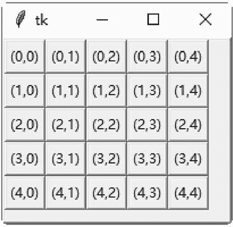

# Tkinter grid()布局

> 原文：[`www.weixueyuan.net/a/557.html`](http://www.weixueyuan.net/a/557.html)

grid() 方法将控件依照表格的行列方式，来放置在窗体或窗口内。

## 1\. grid()方法参数选项

#### 1) row

此选项设置控件在表格中的第几列。

#### 2) column

此选项设置控件在表格中的第几栏。

#### 3) columnspan

此选项设置控件在表格中合并栏的数目。

#### 4) rowspan

此选项设置控件在表格中合并列的数目。

## 2\. grid()方法应用实例

下面的示例是使用 grid() 方法创建一个 5×5 的按钮数组。

```

#grid()方法
from tkinter import *
#主窗口
win = Tk()
#创建窗体
frame = Frame (win, relief=RAISED, borderwidth=2)
frame.pack (side=TOP, fill=BOTH, ipadx=5, ipady=5, expand=1)

#创建按钮数组
for i in range (5):
    for j in range (5):
        Button (frame, text=" (" + str(i) + ","+ str(j)+ ")") .grid(row=i,column=j )
#开始窗口的事件循环
win. mainloop()
```

保存 demo.pyw 文件后，直接双击运行该文件，结果如图 1 所示：
图 1：程序运行结果
 示例代码分析如下：

*   第 6 行：创建一个 Frame 控件，以作为窗体。此窗体的外形突起，边框厚度为 2 像素。
*   第 7 行：此窗体在窗口的顶端（side=TOP），当窗口改变大小时，窗体会占满整个窗口的剩余空间（fill=BOTH）。控件与窗体边界之间的水平距离是 5 像素，垂直距离是 5 像素。
*   第 13～12 行：创建一个按钮数组，按钮上的文字是（row, column）。str(i) 是将数字类型的变量 i 转换为字符串类型。str(j) 是将数字类型的变量 j 转换为字符串类型。