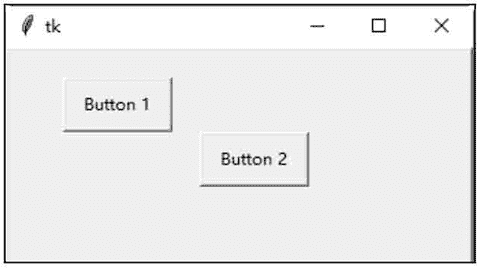

# Tkinter place()布局

> 原文：[`www.weixueyuan.net/a/562.html`](http://www.weixueyuan.net/a/562.html)

place() 方法设置控件在窗体或窗口内的绝对地址或相对地址。

## 1\. place()方法参数选项

#### 1) anchor

此选项定义控件在窗体或窗口内的方位，可以是 N、NE、E、SE、S、SW、W、NW 或 CENTER。默认值是 NW，表示在左上角方位。

#### 2) bordermode

此选项定义控件的坐标是否要考虑边界的宽度。此选项可以是 OUTSIDE 或 INSIDE，默认值是 INSIDE。

#### 3) height

此选项定义控件的高度，单位是像素。

#### 4) width

此选项定义控件的宽度，单位是像素。

#### 5) in(in_)

此选项定义控件相对于参考控件的位置。若使用在键值，则必须使用 in_。

#### 6）relheight

此选项定义控件相对于参考控件（使用 in_ 选项）的高度。

#### 7) relwidth

此选项定义控件相对于参考控件（使用 in_ 选项）的宽度。

#### 8) relx

此选项定义控件相对于参考控件（使用 in_ 选项）的水平位移。若没有设置 in_ 选项，则是相对于父控件。

#### 9）rely

此选项定义控件相对于参考控件（使用 in_ 选项）的垂直位移。若没有设置 in_ 选项，则是相对于父控件。

#### 10) x

此选项定义控件的绝对水平位置，默认值是 0。

#### 11) y

此选项定义控件的绝对垂直位置，默认值是 0。

## 2\. place()方法应用实例

下面的示例是使用 place() 方法创建两个按钮。第一个按钮的位置在距离窗体左上角的 (40,40) 坐标处，第二个按钮的位置在距离窗体左上角的 (140, 80) 坐标处。按钮的宽度均为 80 像素，高度均为 40 像素。

```

#place()方法
from tkinter import *
#主窗口
win = Tk()
#创建窗体
frame = Frame (win, relief=RAISED, borderwidth=2, width=400, height=300)
frame. pack (side=TOP, fill=BOTH,ipadx=5, ipady=5, expand=1)
#第一个按钮的位置在距离窗体左上角的(40，40)坐标处
button1 = Button ( frame, text="Button 1")
button1.place (x=40,y=40, anchor=W, width=80, height=40)
#第二个按钮的位置在距离窗体左.上角的(140，80) 坐标处
button2 = Button (frame, text="Button 2")
button2 .place(x=140,y=80, anchor=W, width=80, height=40)
#开始窗口的事件循环
win. mainloop()
```

保存 demo1.pyw 文件后，直接双击运行该文件，结果如图 1 所示：


图 1：程序运行结果示例代码分析如下：

*   第 6 行：创建一个 Frame 控件，以作为窗体。此窗体的外形突起，边框厚度为 2 像素。窗体的宽度是 400 像素，高度是 300 像素。
*   第 7 行：此窗体在窗口的顶端（side=TOP），当窗口改变大小时，窗体会占满整个窗口的剩余空间（fill=BOTH）。widget 与窗体边界之间的水平距离是 5 像素，垂直距离是 5 像素。
*   第 13～11 行：创建第一个按钮。位置在距离窗体左上角的（40, 40）坐标处，宽度是 80 像素，高度是 40 像素。
*   第 14～15 行：创建第二个按钮。位置在距离窗体左上角的（140, 80）坐标处，宽度是 80 像素，高度是 40 像素。