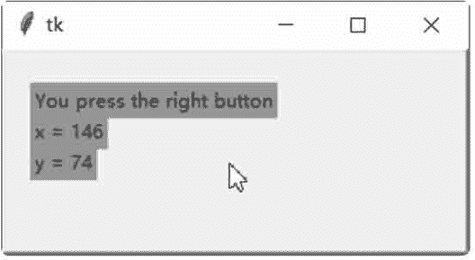

# Tkinter 鼠标事件处理

> 原文：[`www.weixueyuan.net/a/566.html`](http://www.weixueyuan.net/a/566.html)

在处理键盘、鼠标等动作时，只要设置好事件处理例程（此函数称为 callback），就可以在控件内处理这些事件。当处理鼠标事件时，1 代表鼠标左键，2 代表鼠标中间键，3 代表鼠标右键。下面是鼠标事件：

*   <Enter>，此事件在鼠标指针进入控件时发生。
*   <Leave>，此事件在鼠标指针离开控件时发生。
*   <Button-1>、<ButtonPress-1>、或<1>，此事件在控件上单击鼠标左键时发生。同理，<Button-2> 是在控件上单击鼠标中间键时发生，<Button-3> 是在控件上单击鼠标右键时发生。
*   <B1-Motion>，此事件在单击鼠标左键，移动控件时发生。
*   <ButtonRelease-1>，此事件在释放鼠标左键时发生。
*   <Double-Button-1>，此事件在双击鼠标左键时发生。

在窗口内创建一个窗体，在窗体内创建三个文字标签。在窗体内处理所有的鼠标事件，将事件的种类写入第一个文字标签内，将事件发生时的 x 坐标写入第二个文字标签内，将事件发生时的 y 坐标写入第三个文字标签内。

```

from tkinter import *
#处理鼠标光标进入窗体时的事件
def handleEnterEvent (event) :
    label1[ "text"] = "You enter the frame"
    label2 ["text"] =""
    label3["text"] =""
#处理鼠标光标离开窗体时的事件
def handleLeaveEvent (event) :
    label1 ["text"] = "You leave the frame"
    label2 ["text"] = ""
    label3["text"] =""
#处理在窗体内单击鼠标左键的事件
def handleLeftButtonPressEvent (event):
    label1["text"] = "You press the left button"
    label2 ["text"] = "x = "+ str (event.x)
    label3["text"] = "y = "+ str (event.y)
#处理在窗体内单击鼠标中间键的事件
def handleMiddleButtonPressEvent (event):
    label1["text"] = "You press the middle button"
    label2["text"] = "x ="+ str(event.x)
    label3["text"] = "y =" + str(event.y)
#处理在窗体内单击鼠标右键的事件
def handleRightButtonPressEvent (event) :
    label1 ["text"] = "You press the right button"
    label2 ["text"] = "x" + str (event.x)
    label3["text"] = "y="+ str (event.y)
#处理在窗体内单击鼠标左键，然后移动鼠标光标的事件
def handleLeftButtonMoveEvent (event) :
    label1["text"] = "You are moving mouse with the left button pres sed"
    label2["text"] = "x = "+ str (event.x)
    label3["text"] ="y="+ str (event.y)
#处理在窗体内放开鼠标左键的事件
def handleLeftButtonReleaseEvent (event) :
    label1 ["text"] = "You release the left button"
    label2 ["text"] = "x ="+ str (event.x)
    label3["text"] ="y =" + str (event.y)
#处理在窗体内双击鼠标左键的事件
def handleLeftButtonDoubleClickEvent (event) :
    label1["text"] = "You are double clicking the left button"
    label2["text"] = "x =" + str (event.x)
    label3["text"] = "y="+ str (event.y)
#创建主窗口
win = Tk()
#创建窗体
frame = Frame (win, relief=RAISED, borderwidth=2, width=300,height=200)
frame .bind("<Enter>", handleEnterEvent)
frame.bind ("<Leave>", handleLeaveEvent)
frame. bind ("<Button-1>", handleLeftButtonPressEvent)
frame. bind ("<ButtonPress-2>", handleMiddleButtonPressEvent)
frame.bind("<3>", handleRightButtonPressEvent)
frame . bind ("<B1 -Motion>", handleLeftButtonMoveEvent)
frame. bind ("<ButtonRelease-1>", handleLeftButtonReleaseEvent)
frame . bind ("<Double-Button-1>", handleLeftButtonDoubleClickEvent)
#文字标签，显示鼠标事件的种类
label1=Label (frame, text="No event happened", foreground="#0000ff", background="#00ff00")
label1 .place (x=16,y=20)
#文字标签，显示鼠标事件发生时的 x 坐标
label2 = Label (frame, text="x= ", foreground="#0000ff", background= "#00ff00")
label2.place(x=16, y=40)
#文字标签，显示鼠标事件发生时的 y 坐标
label3 = Label (frame, text="y= ", foreground="#0000ff", background= "#00ff00")
label3.place (x=16,y=60)
#设置窗体的位置
frame.pack (side=TOP)
#开始窗口的事件循环
win . mainloop()
```

保存 demo1.pyw 文件后，直接双击运行该文件，结果如图 1 所示：


图 1：程序运行结果