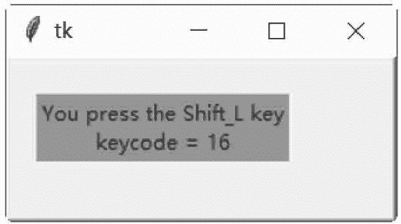

# Tkinter 键盘事件处理

> 原文：[`www.weixueyuan.net/a/574.html`](http://www.weixueyuan.net/a/574.html)

tkinter 可以处理所有的键盘事件，包括 Ctrl、Alt、F1、Home 等特殊键。

下面是键盘事件：

*   <Key>：此事件在按下 ASCII 码为 48～90 时发生，即数字键、字母键及 +、～ 等符号。
*   <Control-Up>：此事件在按下 Ctrl+Up 组合键时发生。同理，可以使用类似的名称在 Alt、Shift 键加上 Up、Down、Left 与 Right 键。
*   其他按键，使用其按键名称。包括 <Return>、<Escape>、<F1>、<F2>、<F3>、<F4>、<F5>、<F6>、<F7>、<F8>、<F9>、<F13>、<F11>、<F12>、<Num_Lock>、<Scroll_Lock>、<Caps_Lock>、<Print>、<Insert>、<Delete>、<Pause>、<Prior>（Page Up）、<Next>（Page Down）、<BackSpace>、<Tab>、<Cancel>（Break）、<Control_L>（任何的 Ctr l 键)、<Alt_L>（任何的 Alt 键）、<Shift_L>（任何的 Shift 键）、<End>、<Home>、<Up>、<Down>、<Left>、<Right>。

下面的示例是在窗口内创建一个窗体，在窗体内创建一个文字标签。在主窗口内处理所有的键盘事件，当有按键时，将键盘的符号与 ASCII 码写入文字标签内。

```

#使用 tkinter 事件
from tkinter import *
#处理在窗体内按下键盘按键(非功能键)的事件
def handleKeyEvent (event):
    label1 ["text"] = "You press the "+ event.keysym + " key\n"
    label1["text"] += "keycode = " + str (event.keycode)
#创建主窗口
win = Tk()
#创建窗体
frame = Frame (win, relief=RAISED, borderwidth=2, width=300, height=200)
#将主窗口与键盘事件连接
eventType = ["Key", "Control-Up", "Return", "Escape", "F1", "F2", "F3", "F4",
"F5","F6", "F7", "F8", "F9", "F13", "F11", "F12", "Num_Lock", "Scroll_Lock",
"Caps_Lock", "Print", "Insert", "Delete", "Pause", "Prior", "Next","BackSpace",
"Tab", "Cancel", "Control_L","Alt_L","Shift_L","End", "Home", "Up","Down",
"Left", "Right"]
for type in eventType:
    win.bind("<" + type + ">",handleKeyEvent)
#文字标签，显示键盘事件的种类
label1 = Label (frame, text="No event happened", foreground="#0000ff", background="#00ff00")
label1.place(x=16,y=20)
#设置窗体的位置
frame.pack (side=TOP)
#开始窗口的事件循环
win.mainloop ()
```

以 .pyw 后缀保存文件后，直接双击运行该文件，结果如图 1 所示：


图 1：程序运行结果