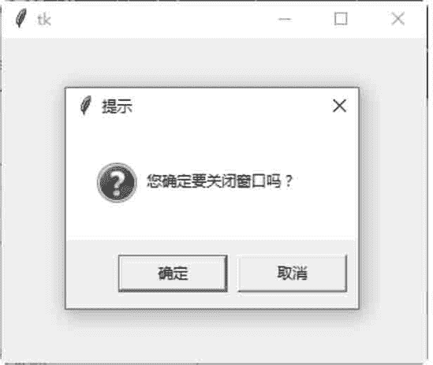

# Tkinter 拦截系统信息

> 原文：[`www.weixueyuan.net/a/575.html`](http://www.weixueyuan.net/a/575.html)

tkinter 提供拦截系统信息的机制，用户可以拦截这些系统信息，然后设置成自己的处理例程，这个机制称为协议处理例程（protocol handler）。

通常处理的协议如下：

*   WM_DELETE_WINDOW：当系统要关闭该窗口时发生。
*   WM_TAKE_FOCUS：当应用程序得到焦点时发生。
*   WM_SAVE_YOURSELF：当应用程序需要存储内容时发生。

虽然这个机制是由 X system 成立的，但是，Tk 函数库可以在所有操作系统上处理这个机制。要将协议与处理例程连接，其语法如下：

widget.protocol(protocol, function_handler)

注意，widget 必须是一个 Toplevel 控件。

下面的示例是拦截系统信息 WM_DELETE_WINDOW。当用户使用窗口右上角的“关闭”按钮关闭打开的窗口时，应用程序会显示一个对话框来询问是否真的结束应用程序。

```

#系统协议拦截事件
from tkinter import *
import tkinter.messagebox
#处理 WM DELETE WINDOW 事件
def handleProtocol () :
    #打开一个[确定/取消]对话框
    if tkinter.messagebox.askokcancel ("提示","你确定要关闭窗口吗? ") :
        #确定要结束应用程序
        win.destroy ()
#创建主窗口
win = Tk()
#创建协议
win.protocol ( "WM DELETE WINDOW", handleProtocol)
#开始窗口的事件循环
win.mainloop ()
```

以 demo1.pyw 保存文件后，直接双击运行该文件。单击窗口右上角的“关闭”按钮，提示对话框如图 1 所示：


图 1：程序运行结果