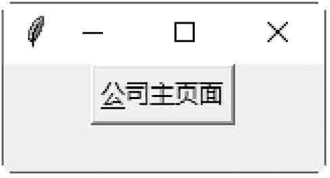

# Tkinter Button：按钮控件

> 原文：[`www.weixueyuan.net/a/583.html`](http://www.weixueyuan.net/a/583.html)

Button 控件用于创建按钮，按钮内可以显示文字或图片。

## 1\. Button 控件的方法

#### 1) flash()

将前景与背景颜色互换，以产生闪烁的效果。

#### 2) invoke()

执行 command 属性所定义的函数。

## 2\. Button widget 的属性

#### 1) activebackground

按钮在作用时的背景颜色。

#### 2) activeforeground

按钮在作用时的前景颜色。

例如：

```

from tkinter import *
win = Tk()
Button(win,activeforeground=" #ff0000",activebackground="#O0ff00", text="关闭",command=win.quit).pack()
win . mainloop ()
```

#### 3) bitmap

显示在按钮上的位图，此属性只有在忽略 image 属性时才有用。此属性一般可设置为 gray12、gray25、gray50、gray75、hourglass、error、questhead、info、warning 或 question。也可以直接使用 XBM(X Bitmap) 文件，在 XBM 文件名称前添加一个 @ 符号，如 bitmap=@hello.xbm。例如：

```

from tkinter import *
win = Tk()
Button (win, bitmap="question", command=win.quit).pack()
win . mainloop ()
```

#### 4) default

若设置此属性，则该按钮为默认按钮。

#### 5) disabledforeground

按钮在无作用时的前景颜色。

#### 6) image

显示在按钮上的图片，此属性的顺序在 text 与 bitmap 属性之前。

#### 7) state

定义按钮的状态，可以是 NORMAL、ACTIVE 或 DISABLED。

#### 8) takefocus

定义用户是否可以使用 Tab 键，以改变按钮的焦点。

#### 9 )text

显示在按钮上的文字。如果定义了 bitmap 或 image 属性，text 属性就不会被使用。

#### 10) underline

一个整数偏移值，表示按钮上的文字哪一个字符要加下画线。第一个字符的偏移值是 0。

#### 11) wraplength

一个以屏幕单位（screen unit）为单位的距离值，用来决定按钮上的文字在哪里需要换成多行。默认值是不换行。

下面的示例是在按钮的第一个文字上添加下画线。

```

from tkinter import *
win = Tk()
Button (win, text="公司主页面",underline=0,command=win.quit).pack()
win.mainloop()
```

保存 .pyw 文件后，直接双击运行该文件，结果如图 1 所示：


图 1：程序运行结果