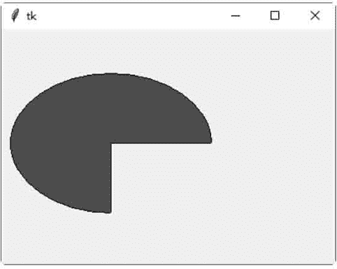
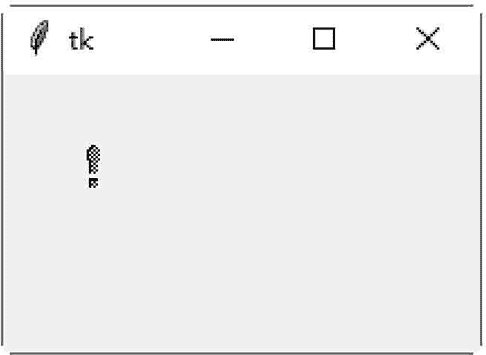
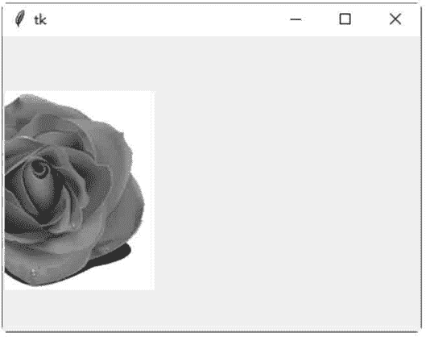
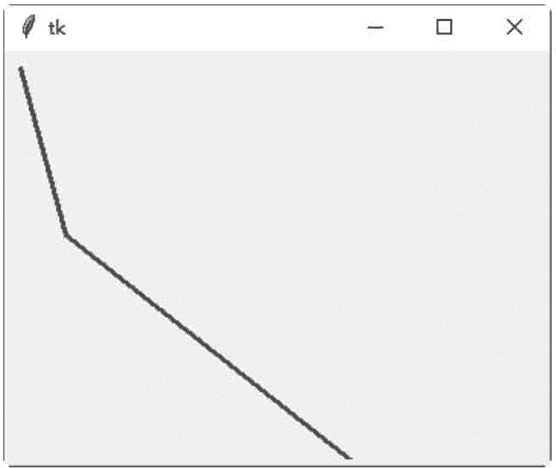
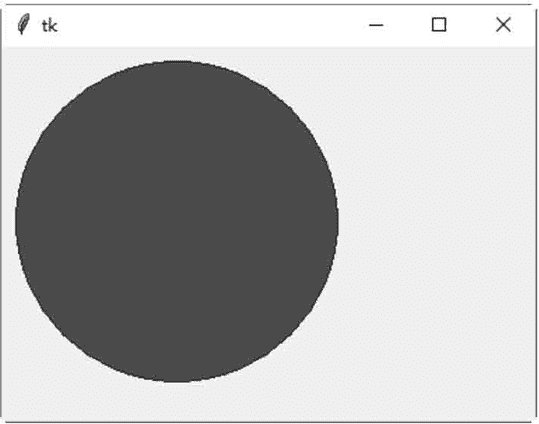
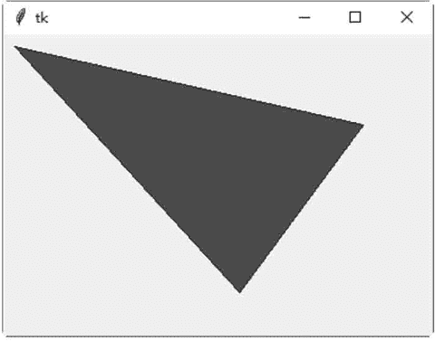
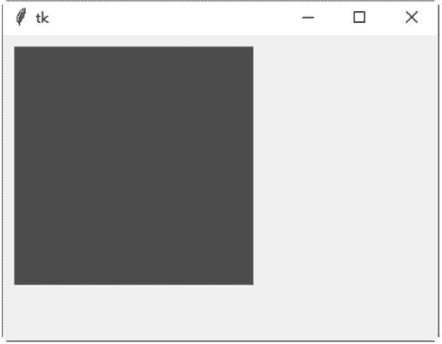
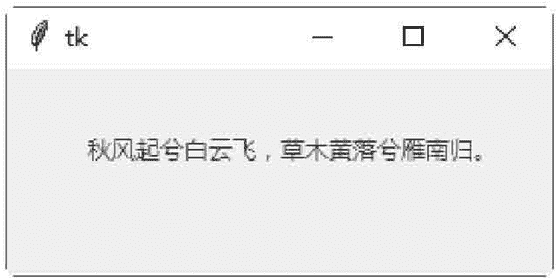

# Tkinter Canvas：绘图控件

> 原文：[`www.weixueyuan.net/a/590.html`](http://www.weixueyuan.net/a/590.html)

Canvas 控件用于创建与显示图形，如弧形、位图、图片、线条、椭圆形、多边形及矩形等。以下是 Canvas 控件的常用方法介绍。

#### **1)** create_arc(coord, start, extent, fill)

创建一个弧形。其中，参数 coord 定义画弧形区块的左上角与右下角坐标；参数 start 定义画弧形区块的起始角度（逆时针方向）；参数 extent 定义画弧形区块的结束角度（逆时针方向）；参数 fill 定义填满弧形区块的颜色。

下面的示例是在窗口客户区的（13, 50）与（240, 213）坐标间画一个弧形，起始角度是 0，结束角度是 270°，使用红色填满弧形区块。

```

from tkinter import *
win = Tk()
coord = 13, 50, 240, 213
canvas = Canvas (win)
canvas.create_arc (coord, start=0,extent=270,fill="red")
canvas .pack()
win . mainloop()
```

保存为 .pyw 文件后，直接双击运行该文件，结果如图 1 所示。


图 1：程序运行结果

#### 2) create_bitmap(x, y, bitmap)

创建一个位图。其中，参数 x 与 y 定义位图的左上角坐标；参数 bitmap 定义位图的来源，可为 gray12、gray25、gray50、gray75、hourglass、error、questhead、info、warning 或 question。也可以直接使用 XBM(X Bitmap)文件，在 XBM 文件名称前添加一个 @ 符号，如 bitmap=@hello.xbm。

```

from tkinter import *
win =Tk ()
canvas = Canvas (win)
canvas.create_bitmap(40, 40,bit_tmap="warning")
canvas .pack ()
win. mainloop ()
```

保存为 .pyw 文件后，直接双击运行该文件，结果如图 1 所示。


图 2：程序运行结果

#### 3) create_image(x, y, image)

创建一个图片。其中，参数 x 与 y 定义图片的左上角坐标；参数 image 定义图片的来源，必须是 tkinter 模块的 BitmapImage 类或 PhotoImage 类的实例变量。 下面的示例是在窗口客户区的（40, 140）坐标处加载一个 "1.gif" 图片文件。

```

from tkinter import *
win = Tk()
img = PhotoImage (file="1.gif")
canvas = Canvas (win)
canvas.create_image(40,140,image= img)
canvas .pack()
win. mainloop()
```

保存为 .pyw 文件后，直接双击运行该文件，结果如图 3 所示：


图 3：程序运行结果

#### 4) create_line(x0, y0, x1, y1, ... , xn, yn, options)

创建一个线条。其中，参数 x0,y0,x1,y1,...,xn,yn 定义线条的坐标；参数 options 可以是 width 或 fill。width 定义线条的宽度，默认值是 1 像素。fill 定义线条的颜色，默认值是 black。 下面的示例是从窗口客户区的（13, 13）坐标处画一条线到 (40, 120) 坐标处，再从 (40, 120) 坐标处画一条线到 (230, 270) 坐标处。线条的宽度是 3 像素，线条的颜色是绿色。

```

from tkinter import *
win = Tk()
canvas = Canvas (win)
canvas .create_line(13,13,40,120,230, 270,width=3, fill="green")
canvas.pack ()
win . mainloop ()
```

运行文件，结果如图 4 所示：


图 4：程序运行结果

#### 5) create_oval(x0, y0, x1, y1, options)

创建一个圆形或椭圆形。其中，参数 x0 与 y0 定义绘图区域的左上角坐标；参数 x1 与 y1 定义绘图区域的右下角坐标；参数 options 可以是 fill 或 outline。fill 定义填满圆形或椭圆形的颜色，默认值是 empty（透明）。outline 定义圆形或椭圆形的外围颜色。 下面的示例是在窗口客户区的（13, 13）到（240, 240）坐标处画一个圆形。圆形的填满颜色是绿色，外围颜色是蓝色。

```

#绘制一个圆形
from tkinter import *
win = Tk()
canvas = Canvas (win)
canvas.create_oval (13,13, 240,240,fill="green",outline="blue")
canvas .pack()
win . mainloop()
```

保存为 .pyw 文件后，直接双击运行该文件，结果如图 5 所示:


图 5：程序运行结果

#### 6) create_polygon(x0, y0, x1, y1, ... , xn, yn, options)

创建一个至少三个点的多边形。其中，参数 x0、y0、x1、y1、...、xn、yn 定义多边形的坐标；参数 options 可以是 fill、outline 或 splinesteps。fill 定义填满多边形的颜色，默认值是 black。outline 定义多边形的外围颜色，默认值是 black。splinestepsg 是一个整数，定义曲线的平滑度。 下面的示例是在窗口客户区的（13, 13）、（320, 80）、（213, 230）坐标处画一个三角形。多边形的填满颜色是绿色，多边形的外围颜色是绿色，多边形的曲线平滑度是 1。
#绘制一个三角形

```

from tkinter import *
win =Tk()
canvas =Canvas(win)
canvas.create_polygon(13, 13,320, 80,213,230, outline="blue",splinesteps=1, fill="green")
canvas .pack ()
win . mainloop ()
```

保存为 .pyw 文件后，直接双击运行该文件；结果如图 6 所示：


图 1：程序运行结果

#### 7) create_rectangle(x0, y0, x1, y1, options)

创建一个矩形。其中，参数 x0 与 y0 定义矩形的左上角坐标；参数 x 与 y1 定义矩形的右下角坐标；参数 options 可以是 fill 或 outline。fill 定义填满矩形的颜色，默认值是 empty（透明）。outline 定义矩形的外围颜色，默认值是 black。

```

from tkinter import *
win = Tk()
canvas = Canvas (win)
canvas. create_ rectangle(13, 13, 220，220， fill="red", outline="")
canvas .pack ()
win . mainloop()
```

保存 demo1.pyw 文件后，直接双击运行该文件；结果如图 7 所示。


图 7：程序运行结果

#### 8) create_text(x0, y0, text, options)

创建一个文字字符串。其中，参数 x0 与 y0 定义文字字符串的左上角坐标，参数 text 定义文字字符串的文字；参数 options 可以是 anchor 或 fill。anchor 定义（x0, y0）在文字字符串内的位置，可以是 N、NE、E、SE、S、SW、W、NW 或 CENTER，默认值是 CENTER。fill 定义文字字符串的颜色，默认值是 empty（透明）。

下面的示例是在窗口客户区的（40, 40）坐标处画一个文字字符串。文字字符串的颜色是红色，（40, 40）坐标是在文字字符串的西面。

#创建一个文字字符串

```

from tkinter import *
win = Tk()
canvas = Canvas (win)
canvas.create_text(40,40, text="秋风起兮白云飞，草木黄落兮雁南归。",fill="red",anchor=W)
canvas.pack()
win.mainloop()
```

保存 demo2.pyw 文件后，直接双击运行该文件，结果如图 8 所示：


图 8：程序运行结果