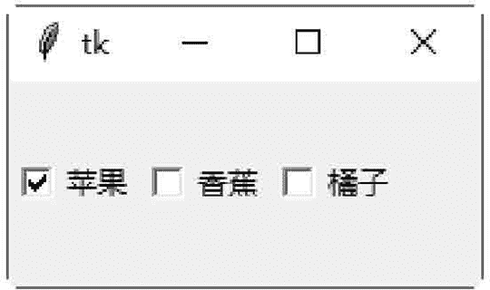

# Tkinter Checkbutton：复选框控件

> 原文：[`www.weixueyuan.net/a/593.html`](http://www.weixueyuan.net/a/593.html)

Checkbutton 控件用于创建复选框。Checkbutton 控件的属性如下：

#### 1) onvalue,offvalue

设置 Checkbutton 控件的 variable 属性指定的变量，所要存储的数值。若复选框没有被选中，则此变量的值为 offvalue；若复选框被选中，则此变量的值为 onvalue。

#### 2）indicatoron

设置此属性为 0，可以将整个控件变成复选框。

Checkbutton 控件的方法如下：

#### 1) select()

选中复选框，并设置变量的值为 onvalue。

下面的示例是在窗口客户区内创建三个复选框，并将三个复选框靠左对齐，然后选择第一个复选框。

```

#创建三个复选框
from tkinter import *
win = Tk()
check1 = Checkbutton(win, text="苹果")
check2 = Checkbutton(win, text="香蕉")
check3 = Checkbutton(win, text="橘子")
check1.select ()
check1.pack (side=LEFT)
check2.pack (side=LEFT)
check3.pack (side=LEFT)
win.mainloop()
```

保存 demo.pyw 文件后，直接双击运行该文件，结果如图 1 所示：


图 1：程序运行结果

#### 2) flash()

将前景与背景颜色互换，以产生闪烁的效果。

#### 3) invoke()

执行 command 属性所定义的函数。

#### 4) toggle()

改变复选框的状态，如果复选框现在的状态是 on，就改成 off；反之亦然。