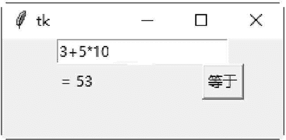

# Tkinter Entry 控件

> 原文：[`www.weixueyuan.net/a/594.html`](http://www.weixueyuan.net/a/594.html)

Entry 控件用于在窗体或窗口内创建一个单行文本框。

Entry 控件的属性为 extvariable，此属性为用户输入的文字，或者是要显示在 Entry 控件内的文字。

Entry 控件的方法为 get()，此方法可以读取 Entry widget 内的文字。

下面的示例是在窗口内创建一个窗体，在窗体内创建一个文本框，让用户输入一个表达式。在窗体内创建一个按钮，单击此按钮后即计算文本框内所输入的表达式。在窗体内创建一个文字标签，将表达式的计算结果显示在此文字标签上。

创建一个简单的计算器，示例代码如下：

```

from tkinter import *
win = Tk()
#创建窗体
frame = Frame (win)
#创建-一个计算器
def calc() :
#将用户输入的表达式，计算结果后转换为字符串
    result = "= "+ str (eval(expression.get()))
    #将计算的结果显示在 Label 控件上
    label.config(text =result)
#创建--一个 Label 控件
label = Label (frame)
#创建一一个 Entry 控件
entry = Entry (frame)
#读取用户输入的表达式
expression = StringVar ()
#将用户输入的表达式显示在 Entry 控件上
entry ["textvariable"] = expression
#创建-一个 Button 控件.当用户输入完毕后，单击此按钮即计算表达式的结果
button1 = Button (frame, text="等 于",command=calc)
#设置 Entry 控件为焦点所在
entry.focus ()
frame.pack ()
#Entry 控件位于窗体的上方
entry .pack()
#Label 控件位于窗体的左方
label .pack (side=LEFT)
#Button 控件位于窗体的右方
button1.pack (side=RIGHT)
#开始程序循环
frame .mainloop()
```

保存 demo.pyw 文件后，直接双击运行该文件。在文本框中输入需要计算的公式，单击“等于”按钮，即可查看运算结果，如图 1 所示。


图 1：程序运行结果