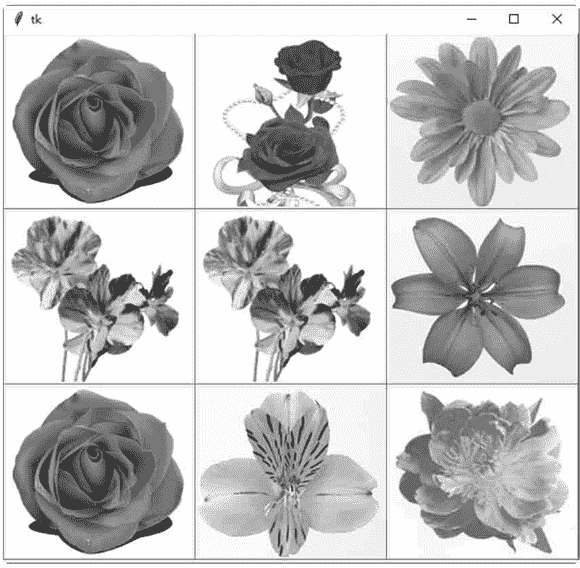
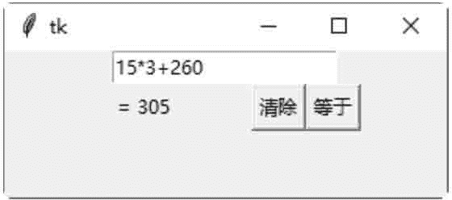
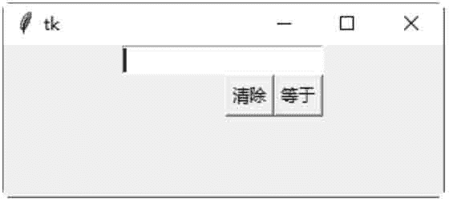

# Tkinter Label 控件

> 原文：[`www.weixueyuan.net/a/597.html`](http://www.weixueyuan.net/a/597.html)

Label 控件用于创建一个显示方块，可以在这个显示方块内放置文字或图片。当用户在 Entry 控件内输入数值时，其值会存储在 tkinter 的 StringVar 类内。可以将 Entry 控件的 textvariable 属性设置成 StringVar 类的实例变量，使用户输入的数值自动显示在 Entry 控件上。

```

#Label 控件
expression = StringVar ()
entry = Entry(frame, textvariable=expression)
entry .pack ()
```

此方式也适用于 Label 控件上。可以使用 StringVar 类的 set() 方法直接写入 Label 控件要显示的文字。例如：

```

expression = StringVar ()
Label (frame, textvariable=expression) .pack()
expression.set ("Hello Python")
```

在窗口内创建一个 3×3 的窗体表格，在每一个窗体内创建一个 Label 控件。在每一个 Label 控件内加载一张图片，其中图片的名称分别为 a0～a8.gif，共 9 张图片。

```

#创建一个窗体表格
from tkinter import *
win = Tk()
#设置图片文件的路径 window 路径格式为\\
path = "D:\\python\\ch123"
img =[]
#将 9 张图片放入一个列表中
for i in range (9) :
    img.append (PhotoImage (file=path + "a" + str(i) + ".gif") )
#创建 9 个窗体
frame=[]
for i in range (3):
    for j in range (3):
        frame.append (Frame (win, relief=RAISED, borderwidth=1,width=158, height=112) )
#创建 9 个 Label 控件
        Label (frame[j+i*3],image=img[j+i*3]).pack()
#将窗体编排成 3X3 的表格
        frame[j+i*3] .grid(row=j, column=i)
#开始程序循环
win . mainloop()
```

保存为 demo.pyw 文件后，直接双击运行该文件，结果如图 1 所示：


图 1：程序运行结果
在《Tkinter Entry 控件》示例代码中，还可以添加清除表达式与文字内容的功能。下面的示例中将新增一个按钮，单击此按钮后，会清除表达式与文字标签的内容。

```

#优化后的计算器
from tkinter import *
win = Tk()
#创建窗体
frame = Frame (win)
#创建一个计算器
def calc() :
#将用户输入的表达式，计算结果后转换为字符串
    result = "= "+ str (eval (expression.get() ) )
    #将计算的结果显示在 Label widget 上
    label.config(text = result)
#清除文本框与文字标签的内容
def clear() :
    expression.set ("")
    label .config(text = "")
#创建一一个 Label 控件
label = Label (frame)
#读取用户输入的表达式
expression = StringVar()
#创建一一个 Entry 控件，Entry 控件位于窗体的上方
entry = Entry (frame, textvariable=expression)
entry .pack()
#创建一个 Button 控件.当用户输入完毕后，单击此按钮即计算表达式的结果
button1 = Button(frame, text="等于",command=calc)
button2 = Button(frame, text="清除",command=clear)
#设置 Entry 控件为焦点所在
entry. focus ()
frame.pack()
#Label 控件位于窗体的左方
label .pack (side=LEFT)
#Button 控件位于窗体的右方
button1\. pack (side=RIGHT)
button2\. pack (side=RIGHT)
#开始程序循环
frame.mainloop()
```

保存 demo2.pyw 文件后，直接双击运行该文件。在打开的窗口文本框中输入需要计算的公式，单击“等于”按钮，即可查看运算结果，如下 2 图所示：


图 2：程序运行结果
单击“清除”按钮，即可清除文本框中的表达式和标签的内容，如图 3 所示：


图 3：程序运行结果