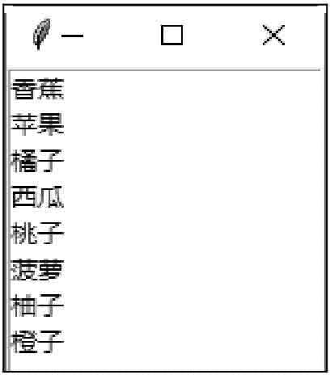

# Tkinter Listbox：列表框控件

> 原文：[`www.weixueyuan.net/a/605.html`](http://www.weixueyuan.net/a/605.html)

Listbox 控件用于创建一个列表框。列表框内包含许多选项，用户可以只选择一项或多项。

## 1\. Listbox 控件的属性

#### 1) height

此属性设置列表框的行数目。如果此属性为 0，就自动设置为能找到的最大选择项数目。

#### 2) selectmode

此属性设置列表框的种类，可以是 SINGLE、EXTENDED、MULTIPLE、或 BROWSE。

#### 3) width

此属性设置每一行的字符数目。如果此属性为 0，就自动设置为能找到的最大字符数目。

## 2\. Listbox 控件的方法

#### 1)delete(row [, lastrow])

删除指定行 row，或者删除 row 到 lastrow 之间的行。

#### 2) get(row)

取得指定行 row 内的字符串。

#### 3) insert(row , string)

在指定列 row 插入字符串 string。

#### 4) see(row)

将指定行 row 变成可视。

#### 5) select_clear()

清除选择项。

#### 6) select_set(startrow , endrow)

选择 startrow 与 endrow 之间的行。

下面的示例是创建一个列表框，并插入 8 个选项：

```

from tkinter import *
win = Tk()
#创建窗体
frame = Frame (win)
#创建列表框选项列表
name = ["香蕉","苹果","橘子","西瓜","桃子","菠萝","柚子","橙子"]
#创建 Listbox 控件
listbox = Listbox (frame)
#清除 Listbox 控件的内容
listbox.delete(0,END)
#在 Listbox 控件内插入选项
for i in range (8) :
    listbox. insert (END,name[i] )
listbox. pack()
frame .pack ()
#开始程序循环
win. mainloop ()
```

保存 demo.pyw 文件后，直接双击运行该文件，结果如图 1 所示：


图 1：程序运行结果