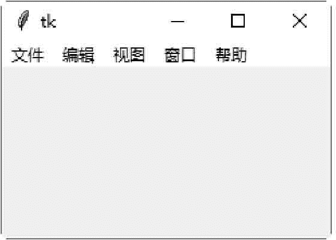
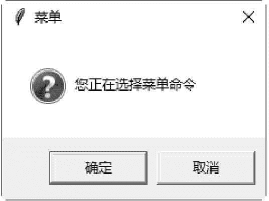
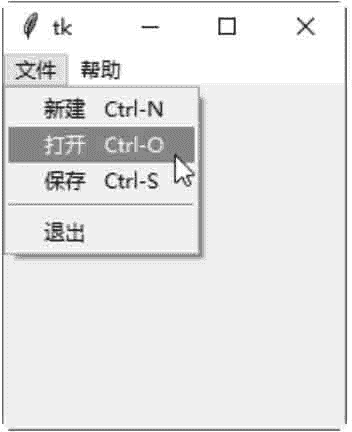
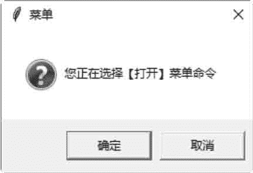
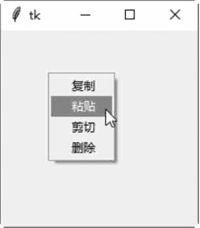
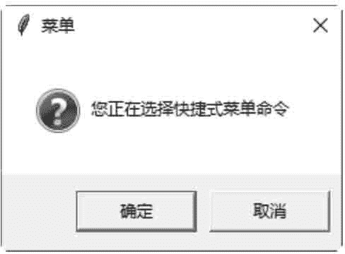

# Tkinter Menu：菜单控件

> 原文：[`www.weixueyuan.net/a/606.html`](http://www.weixueyuan.net/a/606.html)

Menu 控件用于创建三种类型的菜单，即 pop-up（快捷式菜单）、toplevel（主目录）及 pull-down（下拉式菜单）。

Menu 控件的方法如下表所示：

Menu 控件常用方法

| 方法 | 说明 |
| add_command(options) | 新增一个菜单项 |
| add_radiobutton(options) | 创建一个选择钮菜单项 |
| add_checkbutton(options) | 创建一个复选框菜单项。 |
| add_cascade(options) | 将一个指定的菜单与其父菜单连接，创建一个新的级联菜单。 |
| add_separator() | 新增一个分隔线 |
| add(type, options) | 新增一个特殊类型的菜单项 |
| delete(startindex [, endindex]) | 删除 startindex 到 endindex 之间的菜单项 |
| entryconfig(index, options) | 修改 index 菜单项 |
| index(item) | 返回 index 索引值的菜单项标签 |

Menu 控件的属性如下所示：

Menu 常用控件属性

| 属性 | 说明 |
| accelerator | 设置菜单项的快捷键，快捷键会显示在菜单项目的右边。注意，此选项并不会自动将快捷键与菜单项连接在一起，必须另行设置。 |
| command | 选择菜单项时执行的 callback 函数。 |
| indicatorOn | 设置此属性，可以让菜单项选择 on 或 off |
| label | 定义菜单项内的文字 |
| menu | 此属性与 add_cascade() 方法一起使用，用来新增菜单项的子菜单项。 |
| selectColor | 菜单项 on 或 off 的颜色。 |
| state | 定义菜单项的状态，可以是 normal、active 或 disabled。 |
| onvalue，offvalue | 存储在 variable 属性内的数值。当选择菜单项时，将 onvalue 内的数值复制到 variable 属性内。 |
| tearOff | 如果此选项为 True，在菜单项目的上面就会显示一个可选择的分隔线。此分隔线，会将此菜单项分离出来成为一个新的窗口 |
| underline | 设置菜单项中哪一个字符要有下画线 |
| value | 选择按钮菜单项的值 |
| variable | 用于存储数值的变量 |

## 实例 1：创建主目录

下面的示例将创建一个主目录（toplevel）菜单，并新增 5 个菜单项。

```

#Menu 控件
from tkinter import *
import tkinter . messagebox
#创建主窗口
win = Tk()
#执行菜单命令，显示一个对话框
def doSomething() :
    tkinter.messagebox . askokcancel ("菜单","你正在选择菜单命令")
#创建一一个主目录(toplevel)
mainmenu = Menu (win)
#新增菜单项
mainmenu. add_command (label="文件",command=doSomething)
mainmenu. add_command (label="编辑",command=doSomething)
mainmenu. add_command (label="视图",command=doSomething)
mainmenu. add_command (label="窗口",command=doSomething)
mainmenu . add_command (label="帮助",command=doSomething)
#设置主窗口的菜单
win.config (menu=mainmenu)
#开始程序循环
win . mainloop()

```

保存 demo.pyw 文件后，直接双击运行该文件，结果如图 1 所示：


图 1：主目录菜单
选择任意一个菜单，将会弹出提示对话框，如图 2 所示：


图 2：提示对话框

## 实例 2：创建下拉菜单

下面的示例将创建一个下拉式菜单（pull-down），并在菜单项目内加入快捷键。

```

#创建一个下拉式菜单
from tkinter import *
import tkinter .messagebox
#创建主窗口
win = Tk()
#执行[文件/新建]菜单命令，显示一个对话框
def doFileNewCommand (*arg) :
    tkinter .messagebox. askokcancel ("菜单","你正在选择“新建”菜单命令")
#执行[文件/打开]菜单命令，显示一一个对话框
def doFileOpenCommand(*arg) :
    tkinter .messagebox .askokcancel ("菜单", "你正在选择“打开”菜单命令")
#执行[文件/保存]菜单命令，显示-一个对话框
def doFileSaveCommand(*arg) :
    tkinter . messagebox. askokcancel ("菜单","你正在选择“文档”菜单命令")
#执行[帮助/档]菜单命令,显示一个对话框
def doHelpContentsCommand(*arg) :
    tkinter .messagebox . askokcancel ("菜单", "你正在选择“保存”菜单命令")
#执行[帮助/文关于]菜单命令，显示一个对话框
def doHelpAboutCommand(*arg) :
    tkinter . messagebox . askokcancel ("菜单", "你正在选择“关于”菜单命令")
#创建-一个下拉式菜单(pull-down)
mainmenu = Menu (win)
#新增"文件"菜单的子菜单
filemenu = Menu (mainmenu, tearoff=0)
#新增"文件"菜单的菜单项
filemenu.add_command (label="新建",command=doFileNewCommand,accelerator="Ctrl-N")
filemenu.add_command (label="打开",
command=doFileOpenCommand, accelerator="Ctrl-O")
filemenu.add_command (label="保存",
command=doFileSaveCommand, accelerator="Ctrl-S")
filemenu. add_separator ()
filemenu.add_command (label="退出",command=win. quit)
#新增"文件"菜单
mainmenu.add_cascade (label="文件",menu=filemenu)
#新增"帮助"菜单的子菜单
helpmenu = Menu (mainmenu, tearoff=0)
#新增"帮助"菜单的菜单项
helpmenu.add_command (label="文档",
command=doHelpContentsCommand, accelerator="F1")
helpmenu. add_command (label="关于",
command=doHelpAboutCommand, accelerator="Ctrl-A")
#新增"帮助"菜单
mainmenu.add_cascade (label="帮助",menu=helpmenu)
#设置主窗口的菜单
win.config (menu=mainmenu)
win.bind ("<Control-n>",doFileNewCommand)
win. bind ("<Control-N>", doFileNewCommand)
win.bind ("<Control-o>",doFileOpenCommand)
win. bind ("<Control-O>", doFileOpenCommand)
win. bind ("<Control-s>", doFileSaveCommand)
win.bind ("<Control-S>",doFileSaveCommand)
win.bind("<F1>", doHelpContentsCommand)
win. bind ("<Control-a>", doHelpAboutCommand)
win.bind("<Control-A>",doHelpAboutCommand)
#开始程序循环
win . mainloop()
```

保存 demo.pyw 文件后，直接双击运行该文件，选择“文件”下拉菜单，如下图所示：


图 3：下拉式菜单选择“打开”子菜单，将会弹出提示对话框，如图 4 所示：


图 4：提示对话框

## 实例 3：创建快捷菜单

下面的示例将创建一个快捷式菜单（pop-up）

```

from tkinter import *
import tkinter . messagebox
#创建主窗口
win = Tk()
#执行菜单命令，显示一个对话框
def doSomething() :
    tkinter.messagebox .askokcancel ("菜单","你正在选择快捷式菜单命令")
#创建-个快捷 式菜单(pop-up)
popupmenu = Menu (win, tearoff=0)
#新增快捷式菜单的项目
popupmenu .add_command (label="复制",command=doSomething)
popupmenu . add_command (label="粘贴",command=doSomething)
popupmenu . add_command (label="剪切",command=doSomething)
popupmenu . add_command (label="删除",command=doSomething)
#在单击鼠标右键的窗口(x,y)坐标处，显示此快捷式菜单
def showPopUpMenu (event) :
    popupmenu .post (event.x_root, event.y_root)
#设置单击鼠标右键后，显示此快捷式菜单
win. bind("<Button-3>", showPopUpMenu)
#开始程序循环
win . mainloop()
```

保存 demo3.pyw 文件后，直接双击运行该文件，右击鼠标，弹出快捷式菜单，如图 5 示：


图 5：下拉式菜单
选择“粘贴”菜单命令，将会弹出提示对话框，如图 6 所示。


图 6：提示对话框