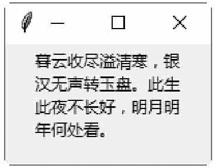

# Tkinter Message 控件

> 原文：[`www.weixueyuan.net/a/612.html`](http://www.weixueyuan.net/a/612.html)

Message 控件用于显示多行、不可编辑的文字。Message 控件会自动分行，并编排文字的位置。

下面的示例是创建一个简单的 Message 控件。

```

#Message 控件
from tkinter import *
#创建主窗口
win = Tk()
txt = "暮云收尽溢清寒，银汉无声转玉盘。此生此夜不长好，明月明年何处看。"
msg = Message (win, text=txt)
msg .pack ()
#开始程序循环
win .mainloop ()
```

保存 demo.pyw 文件后，直接双击运行该文件，结果如图 1 所示：


图 1：程序运行结果 Message 控件与 Label 控件的功能类似，但是 Message 控件多了自动编排的功能。