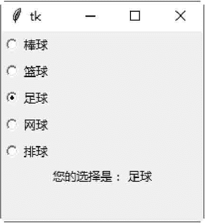
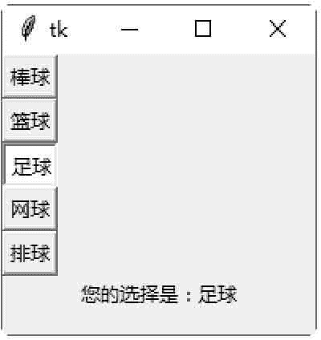

# Tkinter Radiobutton：单选按钮控件

> 原文：[`www.weixueyuan.net/a/616.html`](http://www.weixueyuan.net/a/616.html)

Radiobutton 控件用于创建一个单选按钮。为了让一群单选按钮可以执行相同的功能，必须设置这群单选按钮的 variable 属性为相同值，value 属性值就是各单选按钮的数值。

## 1\. Radiobutton 控件的属性

#### 1) command

当用户选中此单选按钮时，所调用的函数。

#### 2) variable

当用户单选中单选按钮时，要更新的变量。

#### 3) width

当用户选中此单选按钮时，要存储在变量内的值。

## 2\. Radiobutton 控件的方法

#### flash()

将前景与背景颜色互换，以产生闪烁的效果。

#### invoke()

执行 command 属性所定义的函数。

#### select(）

选择此单选按钮，将 variable 变量的值设置为 value 属性值。

下面的示例将创建 5 个运动项目的单选按钮及一个文字标签，将用户的选择显示在文字标签上。

```

from tkinter import *
#创建主窗口
win = Tk()
#运动项目列表
sports = ["棒球", "篮球","足球","网球","排球"]
#将用户的选择显示在 Label 控件上
def showSelection() :
    choice = "你的选择是: " + sports[var.get() ]
    label. config(text = choice)
#读取用户的选择值，是一个整数
var = IntVar ()
#创建单选按钮，靠左边对齐
Radiobutton (win, text=sports[0],variable=var,value=0, command=showSelection).pack (anchor=W)
Radiobutton (win, text=sports[1] ,variable=var,value=1, command=showSelection).pack (anchor=W)
Radiobutton (win, text=sports[2] ,variable=var,value=2,command=showSelection) .pack (anchor=W)
Radiobutton (win, text=sports[3] ,variable=var,value=3, command= showSelection) . pack (anchor=W)
Radiobutton (win, text=sports[4] ,variable=var,value=4, command=showSelection) .pack (anchor=W)
#创建文字标签，用于显示用户的选择
label = Label (win)
label .pack ()
#开始程序循环
win. mainloop()
```

保存为 .pyw 文件后，直接双击运行该文件，选中不同的单选按钮，将提示不同的信息，如图 1 所示：


图 1：程序运行结果下面的示例是创建命令型的单选按钮。

```

#创建命令型的单选按钮
from tkinter import *
#创建主窗口
win = Tk()
#运动项目列表
sports = ["棒球", "篮球","足球","网球","排球"]
#将用户的选择显示在 Label 控件上
def showSelection() :
    choice = "你的选择是: " + sports[var.get() ]
    label . config(text = choice)
#读取用户的选择值，是一个整数
var = IntVar ()
#创建单选按钮
radio1 = Radiobutton (win,text=sports[0] ,variable=var, value=0, command=showSelection)
radio2 = Radiobutton (win,text=sports[1] ,variable=var, value=1, command=showSelection)
radio3 = Radiobutton (win,text=sports[2] ,variable=var,value=2,command= showSelection)
radio4 = Radiobutton (win,text=sports[3] ,variable=var,value=3, command=showSelection)
radio5 = Radiobutton (win,text=sports[4] ,variable=var,value=4, command=showSelection)
#将单选按钮的外型，设置成命令型按钮
radio1.config (indicatoron=0)
radio2.config (indicatoron=0)
radio3.config (indicatoron=0)
radio4.config (indicatoron=0)
radio5.config (indicatoron=0)
#将单选按钮靠左边对齐
radiol .pack (anchor=W)
radio2\. pack (anchor=W)
radio3\. pack (anchor=W)
radio4\. pack (anchor=W)
radio5\. pack (anchor=W)
#创建文字标签，用于显示用户的选择
label = Label (win)
label .pack()
#开始程序循环
win.mainloop ()
```

保存为 .pyw 文件后，直接双击运行该文件，选中不同的命令单选按钮，将提示不同的信息，如图 2 所示：


图 2：程序运行结果