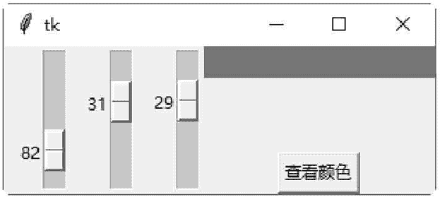

# Tkinter Scale：滑动条控件

> 原文：[`www.weixueyuan.net/a/621.html`](http://www.weixueyuan.net/a/621.html)

Scale 控件用于创建一个标尺式的滑动条对象，让用户可以移动标尺上的光标来设置数值。

Scale 控件的常用方法：

#### 1) get()

取得目前标尺上的光标值。

#### 2) set(value)

设置目前标尺上的光标值。

下面的示例将创建三个 Scale 控件，分别用来选择 R、G、B 三原色的值。移动 Scale 控件到显示颜色的位置后，单击 Show color 按钮即可将 RGB 的颜色显示在一个 Label 控件上。

```

#Scale 滑动条
from tkinter import *
from string import *
#创建主窗口
win = Tk()
#将标尺上的 0~130 范围的数字转换为 0~255 范围的 16 进位数字，
#再转换为两个字符的字符串，如果数字只有一-位，就在前面加一个零
def getRGBStr (value) :
#将标尺 _ 上的 0~130 范围的数字，转换为 0~255 范围的 16 进位数字，
#再转换为字符串
    ret = str (hex (int (value/ 130*255)) )
#将 16 进位数字前面的 0x 去掉
    ret = ret[2:4]
#转换成两个字符的字符串，如果数字只有一-位，就在前面加一个零
    ret = zfill(ret, 2)
    return ret
#将 RGB 颜色的字符串转换为# rrggbb 类型的字符串
def showRGBColor () :
    #读取#rrggbb 字符串的 rr 部分
    strR = getRGBStr (var1.get() )
    #读取#rrggbb 字符串的 gg 部分
    strG = getRGBStr (var2.get() )
    #读取#rrggbb 字符串的 bb 部分
    strB = getRGBStr (var3.get() )
    #转换为# rrggbb 类型的字符串
    color="#"+strR+ strG + strB
    #将颜色字符串设置给 Label 控件的背景颜色
    colorBar.config (background = color)
#分别读取三个标尺的值，是一个双精度浮点数
var1 = DoubleVar ()
var2 = DoubleVar ()
var3 = DoubleVar ()
#创建标尺
scale1 = Scale (win, variable=var1)
scale2 = Scale (win, variable=var2 )
scale3 = Scale (win, variable=var3)
#将选择按钮靠左对齐
scale1.pack (side=LEFT)
scale2.pack (side=LEFT)
scale3.pack (side=LEFT)
#创建一个标签,用于显示颜色字符串
colorBar = Label (win, text="" *40,background=" #000000")
colorBar .pack (side=TOP)
#创建一个按钮，单击后即将标尺上的 RGB 颜色显示在 Label 控件上
button = Button (win, text=" 查看颜色",command=showRGBColor)
button. pack (side=BOTTOM)
#开始程序循环
win.mainloop()
```

保存为 .pyw 文件后，直接双击运行该文件。拖动滑块选择不同的 RGB 值，然后单击“查看颜色”按钮，即可查看对应的颜色效果，如图 1 所示：


图 1：程序运行结果