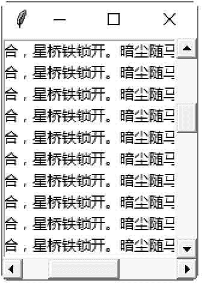

# Tkinter Scrollbar：滚动条控件

> 原文：[`www.weixueyuan.net/a/627.html`](http://www.weixueyuan.net/a/627.html)

Scrollbar 控件用于创建一个水平或垂直滚动条，可与 Listbox、Text、Canvas 等控件共同使用来移动显示的范围。Scrollbar 控件的方法如下：

**1)** set(first, last)，设置目前的显示范围，其值在 0 与 1 之间。

**2)** get()，返回目前的滚动条设置值。

下面的示例是创建一个列表框（60 个选项），包括一个水平滚动条及一个垂直滚动条。当移动水平或垂直滚动条时，改变列表框的水平或垂直方向可见范围。

```

#创建滚动条示例
from tkinter import *
#创建主窗口
win = Tk()
#创建一个水平滚动条
scrollbarl = Scrollbar (win, orient=HORIZONTAL)
#水平滚动条位于窗口底端，当窗口改变大小时会在 X 方向填满窗口
scrollbarl.pack (side=BOTTOM, fill=X)
#创建一个垂直滚动条
scrollbar2 = Scrollbar (win)
#垂直滚动条位于窗口右端，当窗口改变大小时会在 Y 方向填满窗口
scrollbar2 .pack (side=RIGHT, fill=Y)
#创建一个列表框， x 方向的滚动条指 令是 scrollbarl 对象的 set()方法，
#y 方向的滚动条指令是 scrollbar2 对象的 set()方法
mylist = Listbox (win, xscrollcommand=scrollbarl .set,
yscrollcommand= scrollbar2\. set)
#在列表框内插入 60 个选项
for i in range(60) :
    mylist. insert (END, "火树银花合， 星桥铁锁开。暗尘随马去，明月逐人来。" + str(i))
#列表框位于窗口左端，当窗口改变大小时会在 X 与 Y 方向填满窗口
mylist.pack (side=LEFT, fill=BOTH)
#移动水平滚动条时,改变列表框的 x 方向可见范围
scrollbarl.config (command=mylist.xview)
#移动垂直滚动条时，改变列表框的 y 方向可见范围
scrollbar2\. config (command=mylist. yview)
#开始程序循环
win. mainloop()
```

保存 demo.pyw 文件后，直接双击运行该文件，拖动流动滚动条可以查看对应的内容，如图 1 所示：


图 1：程序运行结果