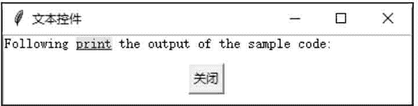

# Tkinter Text 控件

> 原文：[`www.weixueyuan.net/a/630.html`](http://www.weixueyuan.net/a/630.html)

Text 控件用于创建一个多行、格式化的文本框。用户可以改变文本框内的字体及文字颜色。

## 1\. Text 控件的属性

#### 1) state

此属性值可以是 normal 或 disabled。state 等于 normal，表示此文本框可以编辑内容。state 等于 disabled，表示此文本框可以不编辑内容。

#### 2) tabs

此属性值为一个 tab 位置的列表。列表中的元素是 tab 位置的索引值，再加上一个调整字符：l、r、c。l 代表 left，r 代表 right，c 代表 center。

## 2\. Text 控件的方法

#### 1) delete(startindex [, endindex])

删除特定位置的字符，或者一个范围内的文字。

#### 2) get(startindex [, endindex])

返回特定位置的字符，或者一个范围内的文字。

#### 3）index(index)

返回指定索引值的绝对值。

#### 4）insert(index [, string]...)

将字符串插入指定索引值的位置。

#### 5）see(index)

如果指定索引值的文字是可见的，就返回 True。

## 3\. Text 控件支持的类型结构

Text 控件支持三种类型的特殊结构，即 Mark、Tag 及 Index。

#### 1) Mark

Mark 用来当作书签，书签可以帮助用户快速找到文本框内容的指定位置。tkinter 提供了两种类型的书签，即 INSERT 与 CURRENT。INSERT 书签指定光标插入的位置，CURRENT 书签指定鼠标光标最近的位置。

Text 控件用来操作书签的方法如下：

*   index(mark)：返回书签行与列的位置。
*   mark_gravity(mark [, gravity])：返回书签的 gravity。如果指定了 gravity 参数，就设置此书签的 gravity。此方法用在要将插入的文字准确地放在书签的位置时。
*   mark_names()：返回 Text 控件的所有书签。
*   mark_set(mark, index)：设置书签的新位置。
*   mark_unset(mark)：删除 Text 控件的指定书签。

#### 2) Tag

Tag 用于来将一个范围内的文字指定一个标签名称，如此就可以很容易地将此范围内的文字同时修改其设置值。Tag 也可以用于将一个范围与一个 callback 函数连接。tkinter 提供一种类型的 Tag：SEL。SEL 指定符合目前的选择范围。

Text 控件用来操作 Tag 的方法如下：

*   tag_add(tagname, startindex [, endindex]...)：将 startindex 位置或 startindex 到 endindex 之间的范围指定为 tagname 名称。
*   tag_config()：用来设置 tag 属性的选项。选项可以是 justify，其值可以是 left、right、或 center；选项可以是 tabs，tabs 与 Text 控件的 tag 属性功能相同；选项可以是 underline，underline 用于在标签文字内加下画线。
*   tag_delete(tagname)：删除指定的 tag 标签。
*   tag_remove(tagname, startindex [, endindex]...)：将 startindex 位置或 startindex 到 endindex 之间的范围指定的 tag 标签删除。

#### 3) index

Index 用于指定字符的真实位置。tkinter 提供下面类型的 Index：INSERT、CURRENT、END、line/column("line.column")、line end("line.end")、用户定义书签、用户定义标签（"tag.first","tag.last"）、选择范围（SEL_FIRST，SEL_LAST）、窗口的坐标（"@x,y"）、嵌入对象的名称（窗口，图像）及表达式。

## 4\. Text 控件的应用

下面的示例是创建一个 Text 控件，并在 Text 控件内分别插入一段文字及一个按钮。

```

#创建多行文本框控件
from tkinter import *
#创建主窗口
win = Tk()
win.title(string = "文本控件")
#创建一个 Text 控件
text = Text (win)
#在 Text 控件内插入- -段文字
text.insert (INSERT, "晴明落地犹惆怅，何况飘零泥土中。:\n\n")
#跳下一行
text.insert (INSERT, "\n\n")
#在 Text 控件内插入- -个按钮
button = Button(text, text="关闭",command=win.quit)
text. window_create (END, window=button)
text .pack (fill=BOTH)
#在第一行文字的第 13 个字符到第 14 个字符处插入标签，标签名称为"print"
text.tag_add("print", "1.13", "1.15")
#将插入的按钮设置其标签名称为"button"
text. tag_add ("button", button)
#改变标签"print"的前景与背景颜色,并加下画线
text. tag_config("print", background="yellow", foreground= "blue",underline=1)
#设置标签"button"的居中排列
text. tag_config("button", justify="center")
#开始程序循环
win .mainloop()
```

保存为 .pyw 文件后，直接双击运行该文件，结果如图 1 所示：


图 1：程序运行结果