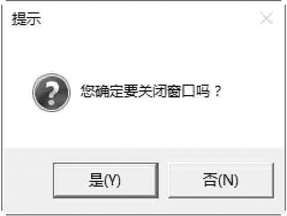
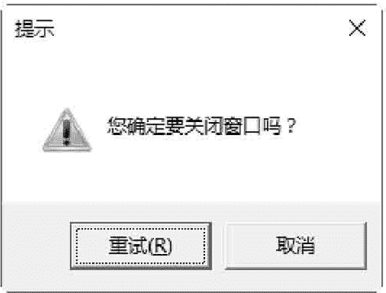
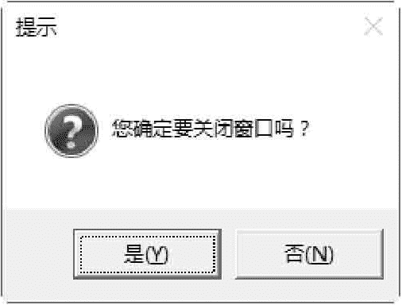
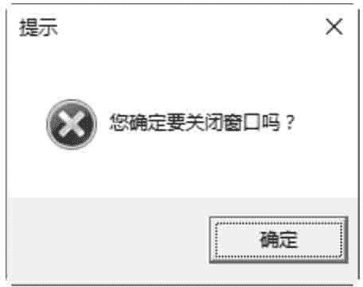
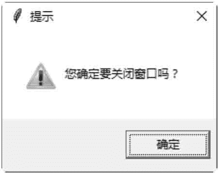

# Tkinter messagebox：消息提示对话框

> 原文：[`www.weixueyuan.net/a/636.html`](http://www.weixueyuan.net/a/636.html)

tkinter 提供不同类型的对话框，这些对话框的功能存放在 tkinter 的不同子模块中，主要包括 messagebox 模块、filedialog 模块和 colorchooser 模块。我们会对以上三个模块分别进行单独的讲解，在本节主要介绍 messagebox 模块。

messagebox 模块提供以下方法打开供用户选择项目的对话框：

#### 1) askokcancel(title=None, message=None)

打开一个“确定／取消”的对话框。例如：

```

>>> import tkinter.messagebox
>>>tkinter.messagebox.askokcancel ("提示"," 你确定要关闭窗口吗? ")
True
```

打开的对话框如图 1 所示。如果单击“确定”按钮，就返回 True；如果单击“取消”按钮，就返回 False。


图 1：“确定／取消”对话框

#### 2) askquestion(title=None, message=None)

打开一个“是／否”的对话框。例如：

```

>>> import tkinter . messagebox
>>>tkinter . messagebox . askquestion("提示"," 你确定要关闭窗口吗? ")
'yes '
```

打开的对话框如图 2 所示。如果单击“是”按钮，就返回 "yes"；如果单击“否”按钮，就返回 "no"。


图 2：“是／否”对话框

#### 3) askretrycancel(title=None, message=None)

打开一个“重试／取消”的对话框。例如：

```

>>> import tkinter . messagebox
>>>tkinter . messagebox . askretrycancel ("提示", "你确定要关闭窗口吗? ")
True
```

打开的对话框如图 3 所示。如果单击“重试”按钮，就返回 True；如果单击“取消”按钮，就返回 False。


图 3：“重试／取消”对话框

#### 4）askyesno(title=None, message=None)：

打开一个“是／否”的对话框。例如：

```

>>> import tkinter .messagebox :
>>>tkinter .messagebox. askyesno ("提示", "你确定要关闭窗口吗? ")
True
```

打开的对话框如图 4 所示。如果单击“是”按钮。就返回 True；如果单击“否”按钮，就返回 False。


图 4：“是／否”对话框

#### 5) showerror(title=None, message=None)

打开一个错误提示对话框。例如：

```

>>> import tkinter .messagebox
>>>tkinter . messagebox.showerror ("提示", "你确定要关闭窗口吗? ")
'ok '
```

打开的对话框如图 5 所示。如果单击“确定”按钮，就返回 "ok"。


图 5：错误提示对话框

#### 6) showinfo(title=None, message=None)

打开一个信息提示对话框。例如：

```

>>> import tkinter .messagebox
>>>tkinter . messagebox. showinfo ("提示", "你确定要关闭窗口吗? ")
'ok'
```

打开的对话框如图 6 所示。如果单击“确定”按钮，就返回 "ok"。


图 6：信息提示对话框

#### 7) showwarning(title=None, message=None)

打开一个警告提示对话框。例如：

```

>>> import tkinter . messagebox
>>>tkinter .messagebox . showwarning("提示","你确定要关闭窗口吗? ")
'ok '
```

打开的对话框如图 7 所示。如果单击“确定”按钮，就返回 "ok"。


图 7：警告提示对话框