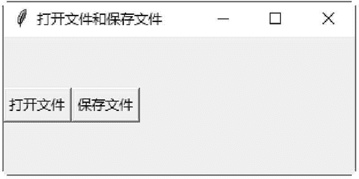
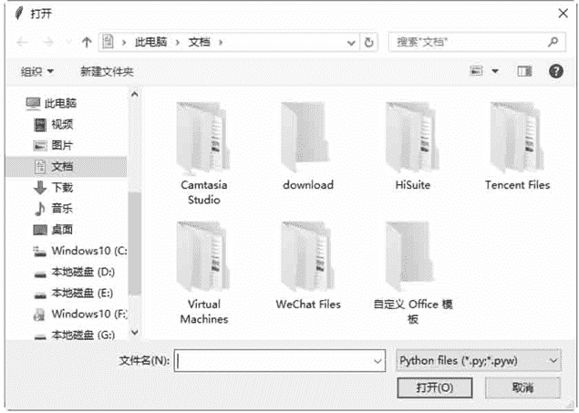
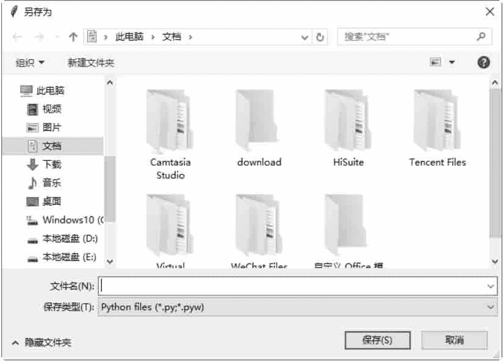

# Tkinter filedialog：文件对话框

> 原文：[`www.weixueyuan.net/a/640.html`](http://www.weixueyuan.net/a/640.html)

tkinter.filedialog 模块可以打开“打开旧文件”对话框或“另存新文件”对话框。

#### 1) Open(master=None, filetypes=None)

打开一个“打开旧文件”的对话框。filetypes 是要打开的文件类型，为一个列表。

#### 2) SaveAs(master=None, filetypes=None)

打开一个“另存新文件”的对话框。filetypes 是要打开的文件类型，为一个列表。

下面的示例创建两个按钮，第一个按钮打开一个“打开旧文件”的对话框，第二个按钮打开一个“另存新文件”的对话框。

```

#创建两种对话框
from tkinter import *
import tkinter . filedialog
#创建主窗口
win = Tk()
win. title(string = "打开文件和保存文件")
#打开一个[打开旧文件]对话框
def createOpenFileDialog() :
    myDialog1\. show ()
#打开一个[另存新文件]对话框
def createSaveAsDialog() :
    myDialog2\. show ()
#单击按钮后，即打开对话框
Button (win, text="打开文件",command=createOpenFileDialog).pack (side=LEFT)
Button (win, text="保存 文件" , command=createSaveAsDialog).pack (side=LEFT)
#设置对话框打开的文件类型
myFileTypes = [ ('Python files', '* .py * .pyw'),('All files','*') ]
#创建一一个[打开旧文件]对话框
myDialog1 = tkinter . filedialog.Open (win, filetypes=myFileTypes )
#创建一个[另存新文件]对话框
myDialog2 = tkinter . filedialog. SaveAs (win, filetypes=myFileTypes)
#开始程序循环
win. mainloop()
```

保存为 .pyw 文件后，直接双击运行该文件，结果如图 1 所示：


图 1：程序运行结果
单击“打开文件”按钮，弹出“打开”对话框，如图 2 所示：


图 2：“打开”对话框

单击“保存文件”按钮，弹出“另存为”对话框，如图 13-51 所示：


图 3：“另存为”对话框