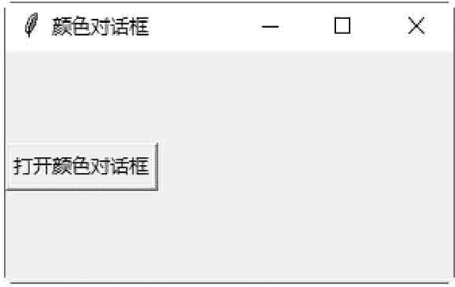
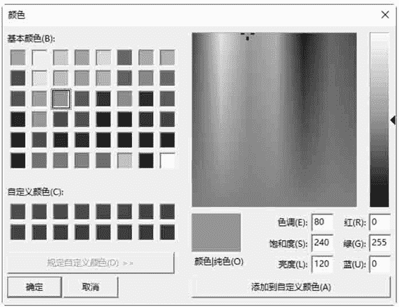
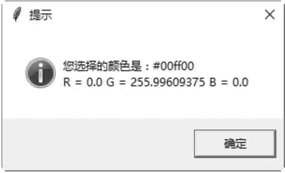

# Tkinter colorchooser：颜色选取对话框

> 原文：[`www.weixueyuan.net/a/641.html`](http://www.weixueyuan.net/a/641.html)

colorchooser 模块用于打开“颜色”对话框。

*   skcolor(color=None)：直接打开一个“颜色”的对话框，不需要父控件与 show() 方法。返回值是一个元组，其格式为 ((R, G, B), "#rrggbb")。
*   Chooser(master=None)：打开一个“颜色”的对话框。返回值是一个元组，其格式为（(R, G, B), "#rrggbb"）。

下面的示例是创建一个按钮，单击该按钮后即打开一个“颜色”对话框。

```

#颜色选择对话框
from tkinter import *
import tkinter . colorchooser, tkinter .messagebox
#创建主窗口
win = Tk()
win.title(string = "颜色对话框")
#打开一个[颜色]对话框
def openColorDialog() :
#显示[颜色]对话框
    color = colorDialog.show ()
#显示所选择颜色的 R,G,B 值
    tkinter .messagebox. showinfo("提示","你选择的颜色是: " + color[1] + "\n"+ "R = "+ str(color[0] [0]) +"G="+str(color[0] [1]) +"B="+
str (color[0] [2]) )
#单击按钮后，即打开对话框
Button(win, text="打开颜色对话框", command=openColorDialog) . pack (side=LEFT)
#创建一个[颜色]对话框
colorDialog = tkinter . colorchooser . Chooser (win)
#开始程序循环
win .mainloop ()
```

保存为 .pyw 文件后，直接双击运行该文件，结果如图 1 所示：


图 1：程序运行结果
 单击“打开颜色对话框”按钮，弹出“颜色”对话框，如图 2 所示：


图 2：颜色对话框
选择一种颜色后，单击“确定”按钮，弹出“提示”对话框，显示选择的颜色值和 RGB 值，如图 3 所示：


图 3：提示对话框