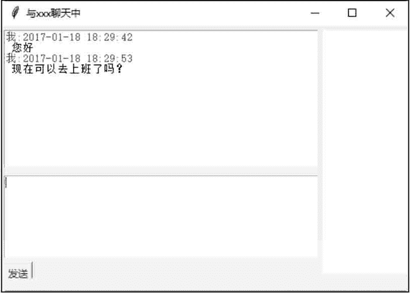

# Tkinter 实现简易的聊天窗口

> 原文：[`www.weixueyuan.net/a/644.html`](http://www.weixueyuan.net/a/644.html)

通过 tkinter 可以轻松实现简易的聊天窗口，源代码如下所示：

```

#制作简易的聊天窗口
from tkinter import *
import datetime
import time
root=Tk ()
root.title('与 xxx 聊天中')
#发送按钮事件
def sendmessage() :
#在聊天内容上方加一行，显示发送人及发送时间
    msgcontent ='我: ' + time.strftime ("%Y-%m-%d %H:%M:%S", time.localtime())+'\n'
    text_msglist.insert (END, msgcontent, 'green')
    text_msglist.insert (END, text_msg.get('0.0', END) )
    text_msg.delete('0.0', END)
#创建几个 frame 作为容器
frame_left_top= Frame (width=380, height=270, bg='white')
frame_left_center= Frame (width=380, height=130, bg='white' )
frame_left_bottom= Frame (width=380,height=20)
frame_right = Frame (width=170,height=400,bg='white')
##创建需要的几个元素
text_msglist= Text (frame_left_top)
text_msg= Text (frame_left_center)
button_sendmsg= Button(frame_left_bottom, text=('发送') ,command= sendmessage)
#创建一一个绿色的 tag
text_msglist.tag_config('green', foreground='#008B00')
#使用 grid 设置各个容器的位置
frame_left_top.grid (row=0,column=0, padx=2,pady=5)
frame_left_center.grid (row=1, column=0, padx=2, pady=5)
frame_left_bottom.grid (row=2,column=0)
frame_right.grid(row=0, column=1, rowspan=3, padx=4, pady=5)
frame_left_top.grid_propagate (0)
frame_left_center.grid_propagate (0)
frame_left_bottom. grid_propagate (0)
#把元素填充进 frame
text_msglist.grid()
text_msg.grid()
button_sendmsg.grid(sticky=E)
#主事件循环
root.mainloop ()
```

保存为 chat.pyw 文件后，直接双击运行该文件。在窗口的下方输入内容后单击“发送”按钮，即可将内容发送到聊天窗口中，如图 1 所示。


图 1：聊天窗口